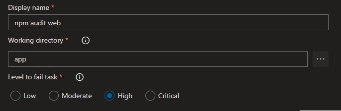

Build extension to run npm audit and fail the build on found vulnerabilites.

## How to use
After installing the extension it will be available as a build task to add to your build pipelines.

After adding the task to a build pipeline you have to configure the task by setting the working directory npm audit will be ran from, and the minimum level the task will fail at. Default level is set to High.

